# Airbnb Clone
## 목차
- [1. 개요](#1.-개요)
- [2. 개발 환경](#2.-개발-환경)
- [3. 주요 구현사항](#3.-주요-구현사항)
- [4. 상세 구현사항](#4.-상세-구현사항)
    - [메인페이지](#메인페이지)
    - [인증 처리](#인증-처리)
        - [OAuth 인증하기](#OAuth-인증하기)
    - [숙소 상세페이지 및 예약 기능](#숙소-상세페이지-및-예약-기능)
    - [호스트 신분으로 숙소 등록](#호스트-신분으로-숙소-등록)
    - [인가 처리](#인가-처리)
    - [호스트와 메시지 주고 받기](#호스트와-메시지-주고-받기)
    - [AWS Elastic Beanstalk로 배포하기](#AWS-Elastic-Beanstalk로-배포하기)
    - [AWS RDS로 데이터베이스 구축하기](#AWS-RDS로-데이터베이스-구축하기)
    - [AWS S3 연동하기](#AWS-S3-연동하기)
    - [Sentry의 서비스를 이용한 실시간 이슈확인](#Sentry의-서비스를-이용한-실시간-이슈확인)
---
## 1. 개요
Django 기반의 웹 애플리케이션 개발에 대해 학습하고자 Nomad Coders의 온라인 강의를 보며 제작한 사이트입니다.
- **[Airbnb 클론 사이트](http://airbnb-clone.efn2p2xx6q.ap-northeast-2.elasticbeanstalk.com/)**

## 2. 개발 환경

- Python3.7
- Django2.2.5
- SQLite3(개발 버전)
- PostgreSQL(배포 버전)
- AWS Elastic Beanstalk
- AWS RDS
- AWS S3

## 3. 주요 구현사항

- 등록된 숙소 리스트 구현
- 숙소 예약구현(예약 확정, 취소 가능)
- 숙소 호스트와의 메시지 전달 기능 구현
- 숙소 즐겨찾기 구현
- 호스트 모드 ON/OFF 구현(호스트 모드 시에 숙소 등록 가능)
- 인가(Authorization)처리 구현
- OAuth인증을 통한 로그인 구현(Github, Kakao)
- [mailgun](https://www.mailgun.com)서비스를 사용하여 회원가입시 이메일 인증 기능 구현
- [sentry](https://sentry.io)서비스를 사용하여 실시간 이슈사항을 확인하도록 구현
- AWS Elastic Beanstalk를 통해 배포
- AWS RDS를 통해 PostgreSQL환경의 데이터베이스 구축
- AWS S3를 통해 이미지 파일 및 CSS파일 저장

## 4. 상세 구현사항
### `메인페이지`
<center>
    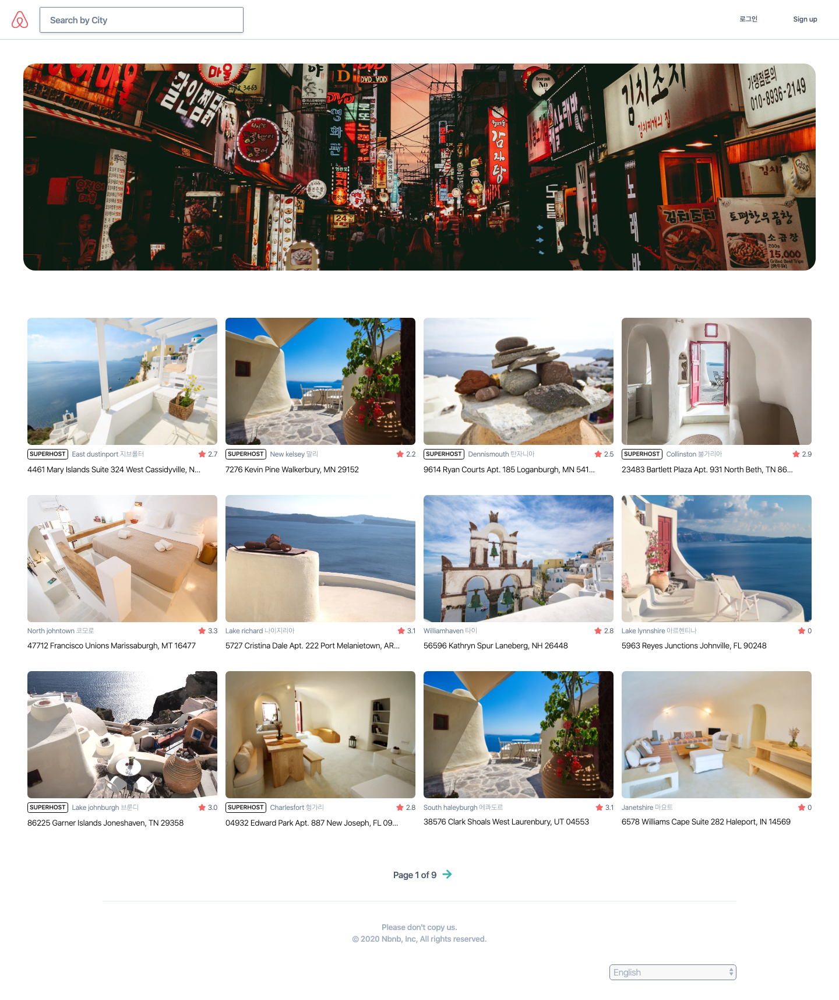
    <div>메인 페이지</div>
</center>

메인페이지에는 등록된 숙소들의 리스트로 구성되며, 상단에는 검색입력바와 메뉴버튼이 있고 아래의 리스트는 Pagenation을 적용하였다.

### `인증 처리`

<div style="display:flex; justify-content: center; text-align: center;">
    <div>
        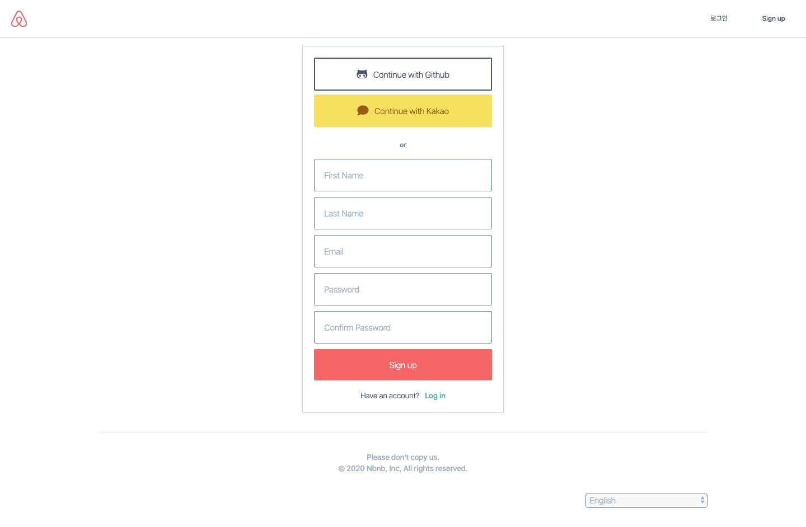
        <div>회원가입 페이지</div>
    </div>
    <div style="margin-left: 5px">
        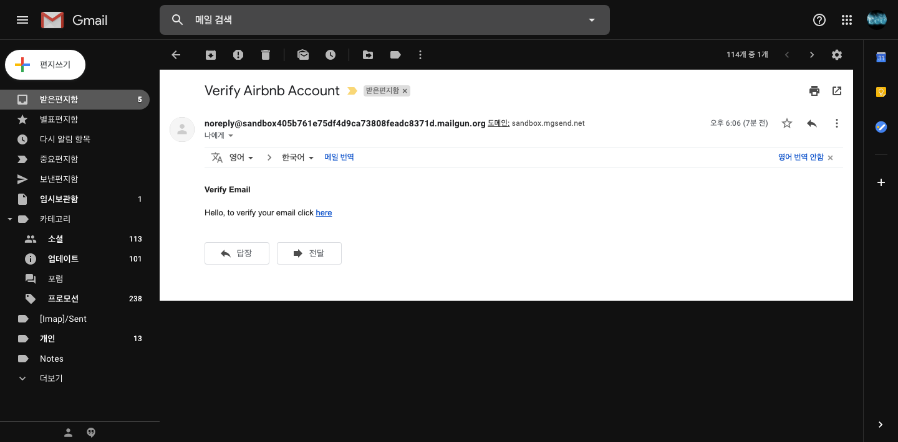
        <div>승인 메일 전송</div>
    </div>
</div>

회원가입은 이메일로 가입하며 가입 즉시 등록한 이메일로 승인 요청 메일이 전송된다.

<div style="display:flex; justify-content: center; text-align: center;">
    <div>
        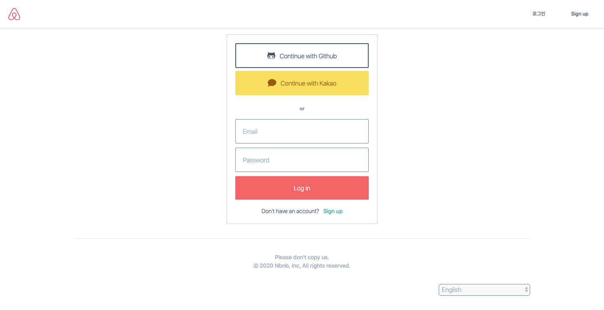
        <div>로그인 페이지</div>
    </div>
    <div style="margin-left: 5px">
        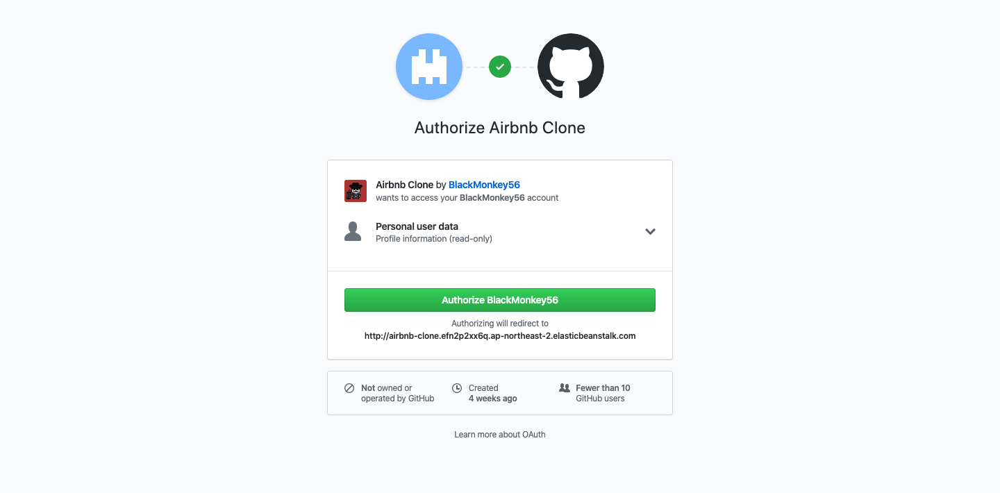
        <div>Github 계정 인증 페이지</div>
    </div>
</div>

#### `OAuth 인증하기`
#### [카카오 계정으로 인증하기]

1. **kakao developer**사이트에 App을 등록하고, *REST API 키*를 가져온다.

<div style="display:flex; justify-content: center; text-align: center;">
    <div>
        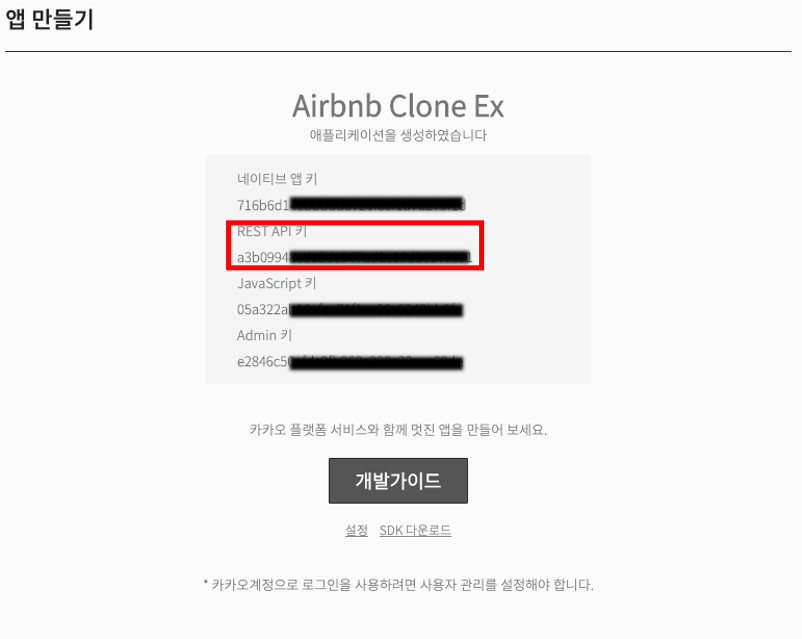
        <div>등록한 App의 API 키</div>
    </div>
</div>

- 이후에는 아래의 링크를 보며 참고하면 된다.<br>
*[개발가이드](https://developers.kakao.com/docs/restapi/user-management)*

2. 다음은 Django에서의 User와 관련된 App내의 views.py코드이다. 사용자가 'Continue with Kakao'라는 버튼을 누르게 되면 실행되는 코드!

    ```python
    def kakao_login(request):
        client_id = os.environ.get("KAKAO_ID")
        redirect_uri = f"{os.environ.get('HOST')}/users/login/kakao/callback"
        return redirect(
            f"https://kauth.kakao.com/oauth/authorize?client_id={client_id}&redirect_uri={redirect_uri}&response_type=code"
        )
    ```

    - client_id: 위에서 언급한 REST API 키이다.
    - redirect_uri: 카카오에서 인증완료 후 리다이렉트되는 주소이다. 

    <div style="display:flex; justify-content: center; text-align: center; margin-top: 20px">
        <div>
            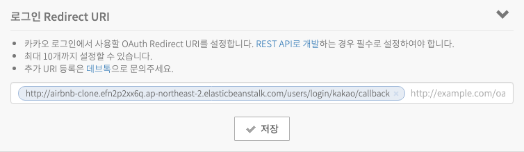
            <div>'사용자 관리' 설정 메뉴</div>
        </div>
    </div>
    
    kakao developers에 등록한 앱의 설정 페이지로 가서 '사용자 관리'에서 위의 사진과 같이 callback처리를 위한 리다이렉트 URI를 등록해야 한다.

3. 인증 완료 후 callback처리
    ```python
    def kakao_callback(request):
        try:
            code = request.GET.get("code")
            client_id = os.environ.get("KAKAO_ID")
            redirect_uri = f"{os.environ.get('HOST')}/users/login/kakao/callback"
            token_request = requests.post(
                f"https://kauth.kakao.com/oauth/token?grant_type=authorization_code&client_id={client_id}&redirect_uri={redirect_uri}&code={code}"
            )
            token_json = token_request.json()
            error = token_json.get("error", None)
            if error is not None:
                raise KakaoException("Can't get autorization code.")
            access_token = token_json.get("access_token")
            profile_request = requests.get(
                "https://kapi.kakao.com/v2/user/me",
                headers={"Authorization": f"Bearer {access_token}"},
            )
            profile_json = profile_request.json()
            kakao_account = profile_json.get("kakao_account")
            email = kakao_account.get("email", None)
            if email is None:
                raise KakaoException("Please also give me your email.")
            properties = profile_json.get("properties")
            nickname = properties.get("nickname")
            profile_image = properties.get("profile_image")
            try:
                user = models.User.objects.get(email=email)
                if user.login_method != models.User.LOGIN_KAKAO:
                    raise KakaoException(f"Please log in with: {user.login_method}.")
            except models.User.DoesNotExist:
                user = models.User.objects.create(
                    email=email,
                    username=email,
                    first_name=nickname,
                    login_method=models.User.LOGIN_KAKAO,
                    email_verified=True,
                )
                user.set_unusable_password()
                user.save()
                if profile_image is not None:
                    photo_request = requests.get(profile_image)

                    user.avatar.save(
                        f"{nickname}-avatar", ContentFile(photo_request.content)
                    )
            login(request, user)
            messages.success(request, f"Welcome back {user.first_name}")
            return redirect(reverse("core:home"))
        except KakaoException as e:
            messages.error(request, e)
            return redirect(reverse("users:login"))
    ```
    - 인증 완료 후 callback처리를 하도록 리다이렉트 되면서 kakao로 부터 **code**를 받게된다.
    - 건내 받은 **code**는 kakao api서버에 접근하기 위한 **access token**을 받아오기 위한 요청에 사용된다.('token_request'에 응답 받은 내용이 저장되며, python의 라이브러리인 *requests*가 사용됨.)
    - **access token**을 받은 후에는 kakao api서버에 요청 시에 header에 token값을 설정하고 사용자 프로필 데이터를 가져온다.
    - 마지막으로 사용자의 이메일이 이미 존재한다면 바로 로그인처리를 하고, 존재하지 않는다면 데이터베이스에 저장 후 로그인하도록 처리한다.

### `숙소 상세페이지 및 예약 기능`
<div style="display:flex; justify-content: center; text-align: center;">
    <div>
        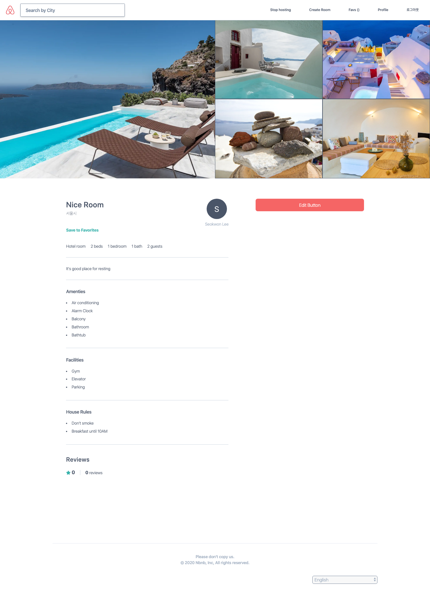
        <div>상세페이지(호스트)</div>
    </div>
    <div style="margin-left: 5px">
        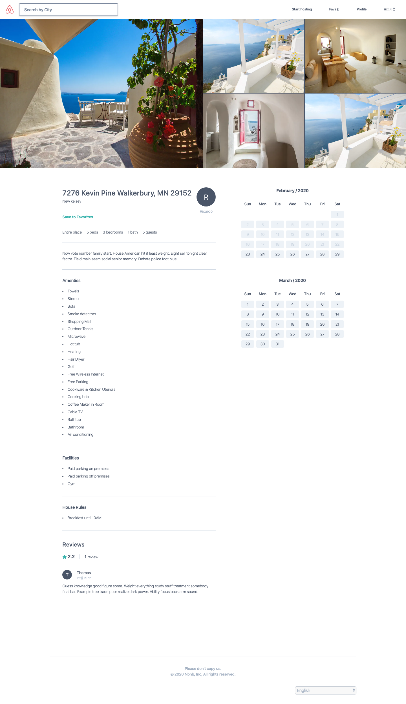
        <div>상세페이지(클라이언트)</div>
    </div>
</div>

- 호스트가 자신이 등록한 숙소의 상세페이지에 접속하면 edit버튼을 볼 수 있다.
- 클라이언트는 edit버튼이 아닌 달력이 보여지며 날짜를 누르면 예약 등록된다.(현재 개발한 사이트는 기간 설정없이 이틀 단위로 등록됨)

<div style="display:flex; justify-content: center; text-align: center;">
    <div>
        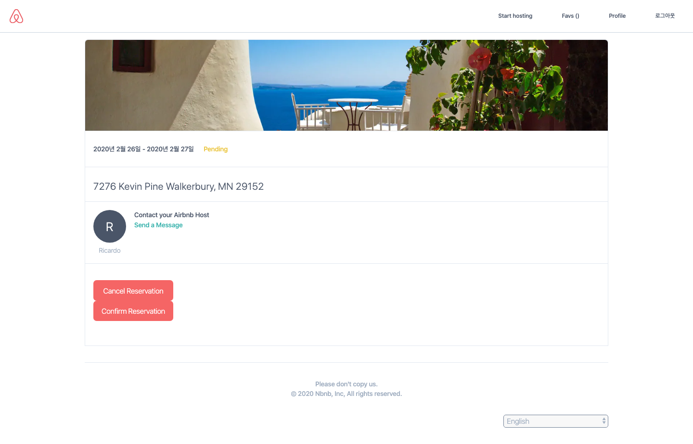
        <div>예약 페이지</div>
    </div>
</div>

- 상세 페이지에서 원하는 날짜를 클릭하게 되면 넘어 오는 예약 페이지로 클라이언트는 확정/취소 버튼을 클릭하여 예약상태를 변경할 수 있다.
- 호스트에게 메시지를 보낼 수 있는 페이지로 이동하는 링크가 존재한다.

### `호스트 신분으로 숙소 등록`
<div style="display:flex-col; justify-content: center; text-align: center;">
    <div>
        
        <div>클라이언트 모드</div>
    </div>
    <div>
        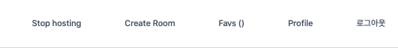
        <div>호스트 모드</div>
    </div>
</div>

- 상단 네비게이션 바에서 Start hosting/Stop hosting 버튼을 통해 호스트 모드를 끄고 켤 수 있다.
- 호스트 모드에서는 숙소를 등록할 수 있다.

<div style="display:flex; justify-content: center; text-align: center;">
    <div>
        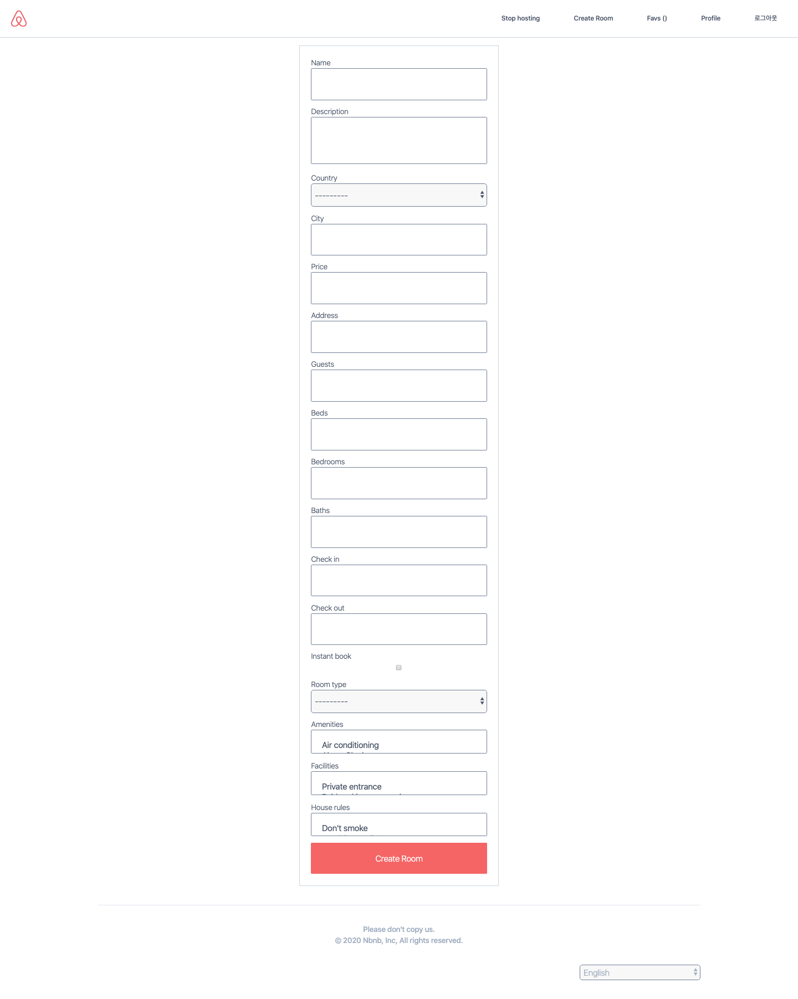
        <div>숙소 등록 페이지</div>
    </div>
    <div style="margin-left: 5px;">
        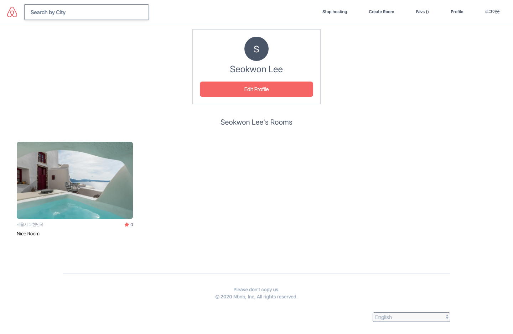
        <div>프로필</div>
    </div>
</div>

- 숙소를 등록하면 호스트는 자신의 프로필 페이지에서 등록한 숙소 리스트를 볼 수 있다.

### `인가 처리`

- UserPassesTestMixin과 LoginRequiredMixin을 상속받아 커스터마이징한 minxin을 사용하였다.(views.py에서 인가 처리가 필요한 부분이 CBV방식으로 구현된 경우에 한함.)

    **[CBV 관련 참고 사이트](http://ccbv.co.uk/)**

    ```python
    from django.contrib import messages
    from django.urls import reverse_lazy
    from django.shortcuts import redirect
    from django.contrib.auth.mixins import UserPassesTestMixin, LoginRequiredMixin


    class LoggedOutOnlyView(UserPassesTestMixin):

        permission_denied_message = "Page not found"

        def test_func(self):
            return not self.request.user.is_authenticated

        def handle_no_permission(self):
            messages.error(self.request, "Can't go there")
            return redirect("core:home")

    class LoggedInOnlyView(LoginRequiredMixin):

        login_url = reverse_lazy("users:login")

    ```

- CBV방식이 아닌 FBV방식에서 인가처리가 필요한 경우 django에서 제공하는 *login_required*라는 데코레이터를 사용하였다.

    ```python
    from django.contrib.auth.decorators import login_required
    ```

### `호스트와 메시지 주고 받기`

<div style="display:flex; justify-content: center; text-align: center;">
    <div>
        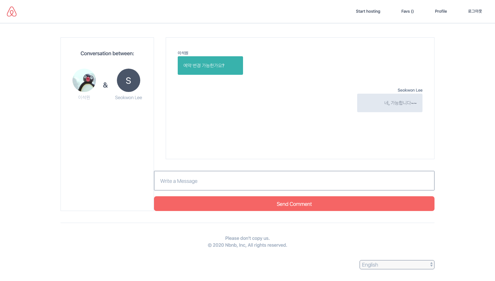
        <div>예약 페이지</div>
    </div>
</div>

- 실시간 채팅이 아닌 단순 메시지 전달 기능.

### `AWS Elastic Beanstalk로 배포하기`

<div style="display:flex; justify-content: center; text-align: center;">
    <div>
        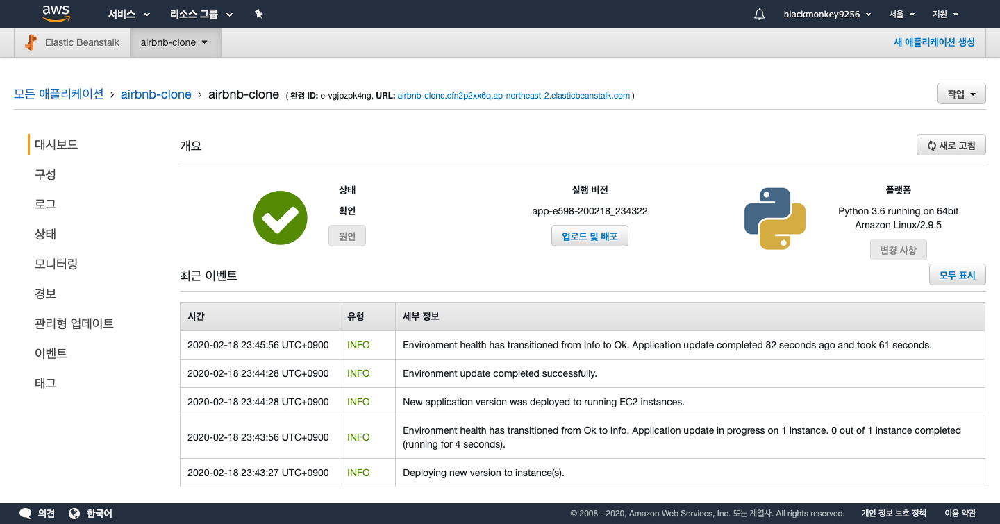
        <div>예약 페이지</div>
    </div>
</div>

- awsebcli를 전역으로 설치해준다.(pipenv로 설치하면 나중에 django-admin명령어와 충돌날 수 있음.)
    - 설치가 끝나면 cli환경에서 eb명령어를 사용할 수 있음.
- eb init를 먼저 실행
- .ebextensions폴더를 만들어준다.
    - django.config 파일을 생성
    ```
    container_commands:
  01_migrate:
    command: "django-admin migrate"
    leader_only: true
  02_compilemessages:
    command: "django-admin compilemessages"

    option_settings:
    aws:elasticbeanstalk:container:python:
        WSGIPath: config/wsgi.py
    aws:elasticbeanstalk:application:environment:
        DJANGO_SETTINGS_MODULE: config.settings
    ```
- eb create [원하는 가상환경 이름]을 실행  
    - 프로젝트의 모든 파일을 압축하여 aws의 서버로 업로드함.
    - 테스트용 서버와 프로덕션 서버 두 개의 가상환경을 만들 수 있음.
- requirements.txt파일을 생성.
- 이후 프로젝트의 수정사항이 생기면 git commit 후 eb deploy명령을 통해 재배포함.

### `AWS RDS로 데이터베이스 구축하기`
- .ebextensions폴더 내에 packages.config 파일을 만든다.
    - AWS에 설치할 항목을 적는다.
    ```
    packages:
    yum:
        postgresql96-devel: []
    ```
- settings.py에 아래와 같은 내용을 추가한다.
    - HOST(endpoint), NAME, USER, PASSWORD는 AWS RDS에서 설정할 때 확인할 수 있다.
    ```python
    DATABASES = {
        "default": {
            "ENGINE": "django.db.backends.postgresql",
            "HOST": os.environ.get("RDS_HOST"),
            "NAME": os.environ.get("RDS_NAME"),
            "USER": os.environ.get("RDS_USER"),
            "PASSWORD": os.environ.get("RDS_PASSWORD"),
            "PORT": "5432",
        }
    }
    ````
- PostgreSQL과 Django를 연결하는 adapter인 **psycopg2**가 설치되어 있어야 한다.

### `AWS S3 연동하기`
- [django-storages](https://django-storages.readthedocs.io/en/latest/backends/amazon-S3.html)를 설치
- settings.py에 추가하기
    ```python
    DEFAULT_FILE_STORAGE = 'config.custom_storages.UploadStorage'
    STATICFILES_STORAGE = 'config.custom_storages.StaticStorage'
    AWS_ACCESS_KEY_ID = os.environ.get("AWS_ACCESS_KEY_ID")
    AWS_SECRET_ACCESS_KEY = os.environ.get("AWS_SECRET_ACCESS_KEY")
    AWS_STORAGE_BUCKET_NAME = "airbnb-clone-lsw"
    AWS_AUTO_CREATE_BUCKET = True
    AWS_DEFAULT_ACL = 'public-read'
    AWS_S3_OBJECT_PARAMETERS = {"CacheControl": "max-age=86400"}

    AWS_S3_CUSTOM_DOMAIN = f"{AWS_STORAGE_BUCKET_NAME}.s3.amazonaws.com"
    STATIC_URL = f"https://{AWS_S3_CUSTOM_DOMAIN}/static/"
    ```
- django-admin collectstatic --noinput명령어를 실행하면 AWS S3에 버킷이 생성된다.(Elastic Beanstalk가 실행하도록...)

<div style="display:flex; justify-content: center; text-align: center;">
    <div>
        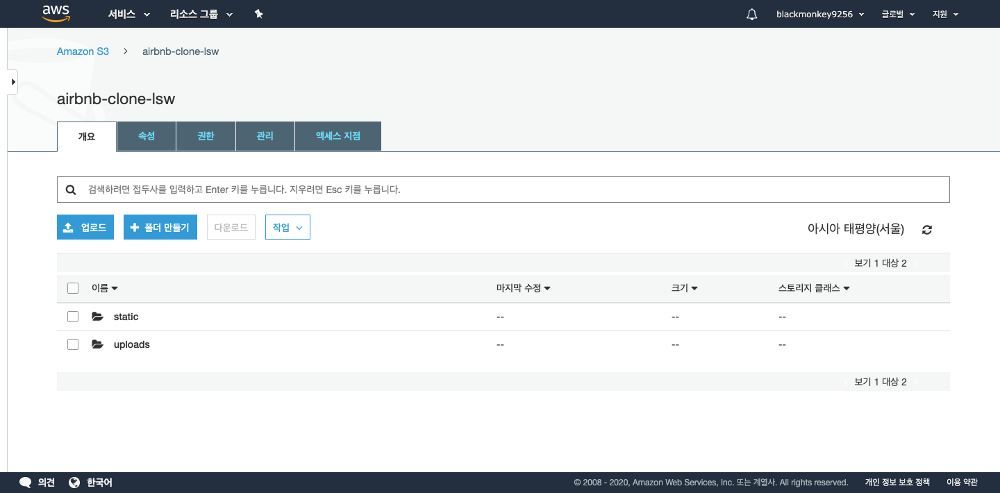
        <div>Sentry.io의 서비스 화면</div>
    </div>
</div>

### `Sentry의 서비스를 이용한 실시간 이슈확인`

<div style="display:flex; justify-content: center; text-align: center;">
    <div>
        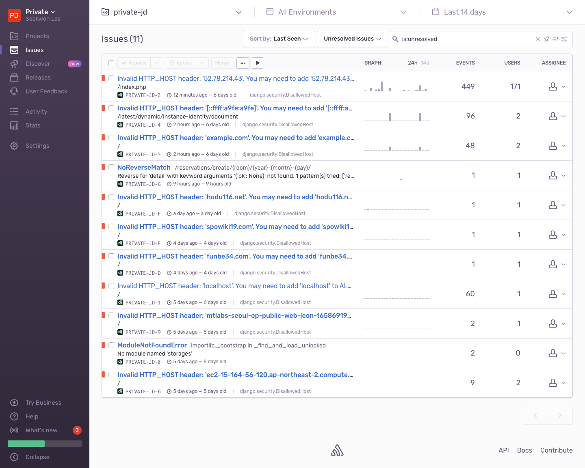
        <div>Sentry.io의 서비스 화면</div>
    </div>
</div>
